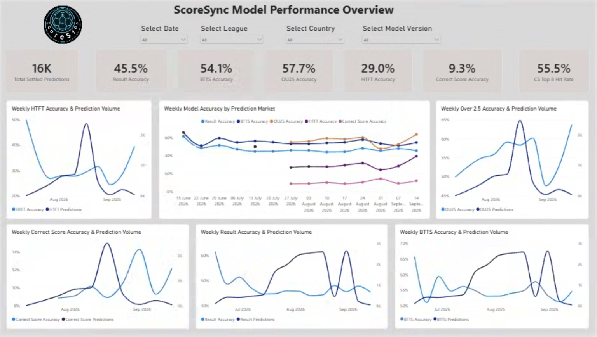
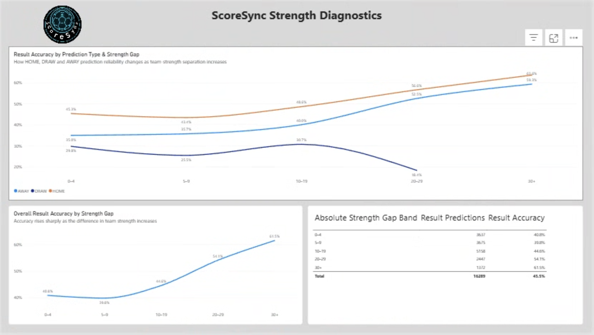
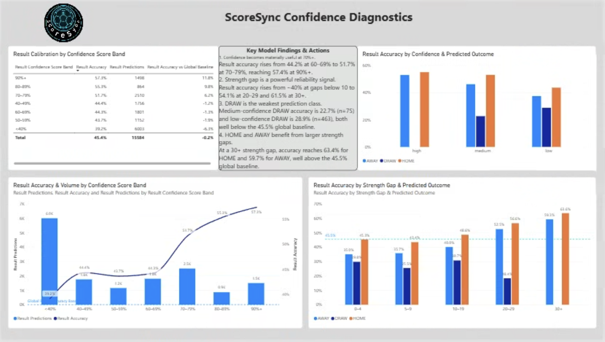
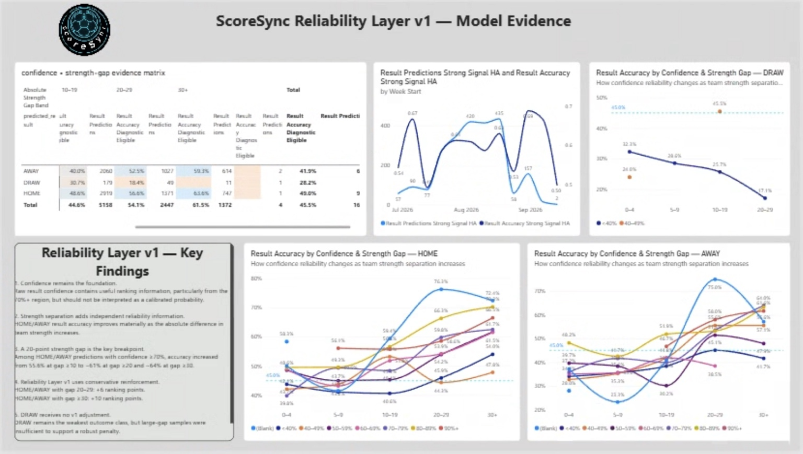

# ScoreSync Prediction Reliability Analytics

An end-to-end analytics and model-monitoring case study showing how production football-prediction data was transformed into an evidence-based reliability-ranking layer.

## Project overview

ScoreSync produces football match predictions and confidence scores. The central analytical question was:

> **When should a high model-confidence score actually be trusted?**

The project connected production PostgreSQL data to Power BI, built model-monitoring diagnostics, identified strength separation as an important reliability signal, and validated a deliberately simple ranking layer on later chronological data.

**Pipeline:** PostgreSQL → Power BI / DAX → diagnostic hypotheses → fixture-level export → Python back-testing → chronological holdout validation → Reliability Layer v1.

## Headline findings

- 16,293 fixture-level records were analysed in the private production study.
- Overall result accuracy was approximately **45.5%**.
- Raw confidence became materially more useful from roughly the **70+** region, but it was not treated as a calibrated probability.
- Absolute team-strength separation was a strong reliability signal:
  - gap ≥10, confidence ≥70, HOME/AWAY: **4,100 predictions at 55.6%**
  - gap ≥20: **2,344 at ~61%**
  - gap ≥30: **1,011 at ~64%**
- A conservative v1 ranking layer was frozen:
  - HOME/AWAY + absolute strength gap 20–29 → **+6 ranking points**
  - HOME/AWAY + absolute strength gap ≥30 → **+10 ranking points**
  - DRAW → no v1 adjustment
- The frozen layer improved raw-confidence ranking across multiple chronological holdouts.

## Reliability Layer v1

```text
reliability_score = result_confidence_score

if predicted_result in {"HOME", "AWAY"}:
    if abs(strength_difference) >= 30:
        reliability_score += 10
    elif abs(strength_difference) >= 20:
        reliability_score += 6
```

The adjustment is **ordinal**. A reliability score of 85 is not claimed to mean an 85% probability of correctness.

## Repository structure

```text
analysis/
  reliability_backtest.py
data/
  sample_anonymised_data.csv
dashboard/
  screenshots/
docs/
  methodology.md
  reliability-layer-v1.md
  ScoreSync_Reliability_Layer_v1.docx
results/
  validation-summary.md
sql/
  analytics_extract.sql
```

## Power BI analytics

Four portfolio views capture the analytical story without exposing unnecessary operational detail.

### 1. Model Performance Overview


Establishes the baseline across settled predictions and ScoreSync's major prediction markets.

### 2. Strength Diagnostics


Shows how result reliability changes as team-strength separation increases, including the contrasting behaviour of HOME, AWAY and DRAW predictions.

### 3. Confidence Diagnostics


Connects model confidence, prediction volume, outcome class and strength separation, motivating joint confidence-strength analysis.

### 4. Reliability Layer v1 — Model Evidence


Summarises the evidence used to freeze Reliability Layer v1: preserve raw confidence as the base ranking signal, reinforce sufficiently separated HOME/AWAY predictions, and leave DRAW unadjusted in v1.

Production credentials, database endpoints and sensitive operational information are excluded.

## Methodology

The analysis deliberately separated **discovery** from **validation**:

1. Establish baseline performance and sample quality.
2. Diagnose confidence calibration and outcome behaviour.
3. Test confidence thresholds while holding other conditions fixed.
4. Test strength-gap thresholds while holding confidence/outcome fixed.
5. Check weekly stability and league robustness.
6. Back-test candidate ranking adjustments.
7. Validate on later chronological holdouts.
8. Remove rules that did not add stable unseen-data value.
9. Freeze the simplest evidence-supported specification.

See `docs/methodology.md` for details.

## Public-data note

The CSV in this repository is a **sanitised sample for portfolio demonstration**. It is not the full ScoreSync production dataset. Production credentials, database endpoints, private application source code, user information and sensitive operational tables are intentionally excluded.

## Skills demonstrated

PostgreSQL · Power BI · DAX · data-quality validation · model monitoring · confidence analysis · hypothesis testing · chronological holdout validation · Python/pandas · engineering specification.

## Status

**Reliability Layer v1: specification frozen; engineering implementation is a separate phase.**
